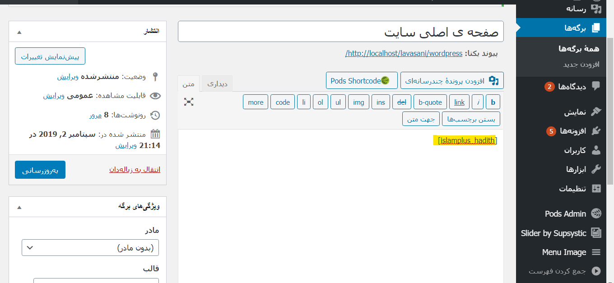

# plugin-hadith-wordpress-islamplus

plugin-hadith-wordpress http://islamplus.net

# FOR DEVELOPER ENV

- first of all please [install Mockoon](https://mockoon.com/#download) for DEV environment
- after install Mockoon open it then import mockoon.json

# persian article

[persian article](https://vrgl.ir/APQYI)

# persian video tutorial

[persian video tutorial](https://narenjitv.com/vs/M8J)

# Installation

- clone this project then move this folder into your wp-content/plugins
- کافیه این فایل رو دانلود کنید و فایل زیپ رو روی وردپرس نصب کنید
- from wordpress admin panel please activate it
- هم میشه از اف تی پی داخل پوشه پلاگین کپی کرد هم میشه از طریق ادمین پنل نصبش کرد
- enjoy it. by salawat on prophet muhammad and all 12+1 other holy persons (with ajjel farajahom please)
- آخرین مرحله اینه که بعد از اینکه فعالش کردید بروید و شورت کد های زیر رو هر جا دلتون خواست اضافه کنید

# How to use it

- put this shortcode [islamplus_hadith] in desired place in your wordpress everywhere you want
- شورت کد بالا رو هر جای وردپرس که دلتون خواست میتونید اضافه کنید

or this:

`[islamplus_hadith context='hadith|quran' language='arabic|english' theme='default|33percent|25percent']`

for example:



- if you want to use with php code you can use

هر جای تم که دلتون خواست میتونید کد پی اچ پی زیر رو کپی کنید و کانفیگ انجام بدید

```
<?php
	echo do_shortcode("[islamplus_hadith]");
?>
```

یا

```
<?php
	echo do_shortcode("[islamplus_hadith context='hadith|quran' language='arabic|english' theme='default|33percent|25percent']");
?>
```

default: is full width
33percent: is for 33 percent
25percent

تم پیش فرض کانفیگی نمیخواد
ولی اگر خواستید تم یک سوم صفحه یا یک چهارم صفحه رو جایی استفاده کنید از کانفیگ بالا استفاده کنید

# Special thanks to

- https://islamplus.net
